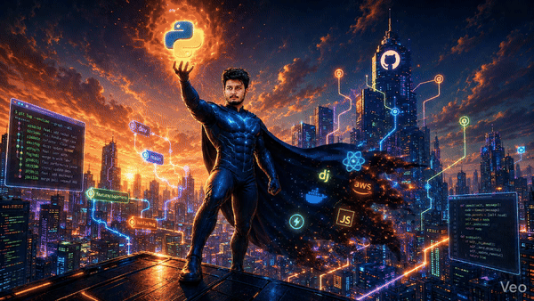

<div align="center">


<p>
  
  
  
</p>

<h3>Building scalable backend systems, AI-powered products, and developer-focused content.</h3>

<p>
  <a href="https://instagram.com/arvind.coder" target="_blank">
    
  </a>
  <a href="https://linkedin.com/in/arvind-s-87251b208" target="_blank">
    
  </a>
  <a href="https://github.com/ArvindSingh1099?tab=repositories" target="_blank">
    
  </a>
  <a href="mailto:iamarvind1099@gmail.com">
    
  </a>
</p>

<br />



</div>

<!--
To regenerate the animated profile GIF from the source MP4, run:
ffmpeg -i input.mp4 -vf "fps=15,scale=600:-1:flags=lanczos,split[s0][s1];[s0]palettegen[p];[s1][p]paletteuse" -loop 0 output.gif

Repo-specific command:
ffmpeg -i Assets/mp_.mp4 -vf "fps=15,scale=600:-1:flags=lanczos,split[s0][s1];[s0]palettegen[p];[s1][p]paletteuse" -loop 0 Assets/output.gif
-->

<details>
<summary><strong>Regenerate the profile GIF</strong></summary>

Use this generic command:

```bash
ffmpeg -i input.mp4 -vf "fps=15,scale=600:-1:flags=lanczos,split[s0][s1];[s0]palettegen[p];[s1][p]paletteuse" -loop 0 output.gif
```

Use this repo-specific command:

```bash
ffmpeg -i Assets/mp_.mp4 -vf "fps=15,scale=600:-1:flags=lanczos,split[s0][s1];[s0]palettegen[p];[s1][p]paletteuse" -loop 0 Assets/output.gif
```

</details>

## About Me

<table>
  <tr>
    <td width="58%" valign="top">
      <ul>
        <li>I work as a <strong>Full Stack / Python Backend / GenAI developer</strong>.</li>
        <li>I build production-focused systems with <strong>Python, Django, FastAPI, React, Angular, AWS, Docker, PostgreSQL, MongoDB, Redis, and Qdrant</strong>.</li>
        <li>I work with <strong>LLMs, prompt engineering, RAG workflows, vector databases, and GenAI chatbots</strong>.</li>
        <li>I create Python and developer content on Instagram at <a href="https://instagram.com/arvind.coder" target="_blank"><strong>@arvind.coder ✓</strong></a>.</li>
        <li>Ask me about <strong>Python, Django, FastAPI, React, AWS, Docker, LLMs, Qdrant, and system design</strong>.</li>
        <li>Reach me at <a href="mailto:iamarvind1099@gmail.com"><strong>iamarvind1099@gmail.com</strong></a>.</li>
      </ul>
    </td>
    <td width="42%" align="center" valign="middle">
      
    </td>
  </tr>
</table>

## Top Skills

<div align="center">


<br />
<br />


</div>

## Tech Stack

<p align="center">
  
  
  
  
  
  
  
  
  
  
  
  
  
  
  
</p>

## GitHub Analytics

<div align="center">


<br />
<br />


<br />
<br />


</div>

## Connect

<p align="center">
  <a href="https://linkedin.com/in/arvind-s-87251b208" target="_blank">
    
  </a>
  <a href="https://instagram.com/arvind.coder" target="_blank">
    
  </a>
  <a href="https://stackoverflow.com/users/arvind-singh" target="_blank">
    
  </a>
  <a href="mailto:iamarvind1099@gmail.com">
    
  </a>
</p>

<div align="center">
  
</div>
